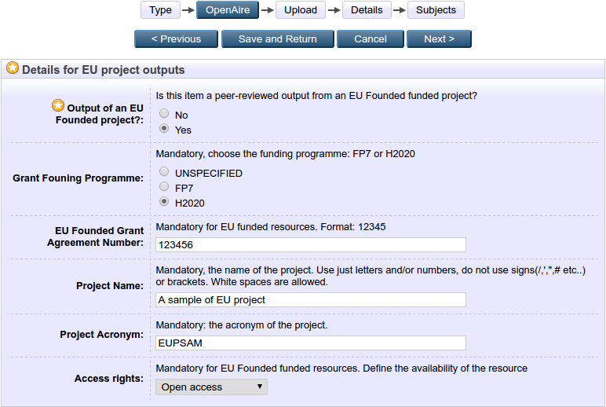

OpenAIRE Compliance
===================

Version: 0.4 (Beta)
EPrints version: 3.2+

This EPrints extension is designed to help the administrators of repositories that contain outputs from EU FP7/H2020 funded projects to achieve compliance with the [OpenAIRE Guidelines version 3.0](https://guidelines.openaire.eu/en/latest/index.html).

In summary, these guidelines state that the outputs from FP7 and H2020 projects must be made avaiable for harvesting via OAI-PMH using a defined set specification. In addition these outputs should meet certain standards in their metadata as defined in the guidelines document.

For installation instructions see the instructions below.

Note: this plug-in has been forked from the [openaire-compliance 0.3 version](https://github.com/eprintsug/openaire-compliance). It introduces the FP7/H2020 option and a user friendly way to add the metatada to build the project namespace at <i>info:eu-repo</i> 

<i>The interface</i>



<i>The relative portion in OAI-PMH push</i>
```xml
<dc:type>info:eu-repo/semantics/article</dc:type>
<dc:relation>info:eu-repo/grantAgreement/EC/FP7/123456/EU/A sample of EU project/EUPSAM</dc:relation>
<dc:rights>info:eu-repo/semantics/openAccess</dc:rights>
```

What this add-on does and doesn't do
------------------------------------

This add-on will:

* Add new metadata fields for EU FP7/H2020 specific elements
* Map the default EPrints data types to their DRIVER equivalents 
* Create a new custom set within the OAI-PMH output of the repository called openaire and containing all resources that are flagged as being outputs of FP7 and H2020 projects
* Add required metadata to the OAI-PMH output
* Check if any files have an embargo date specified (and are restricted access) and alter the rights field in OAI-PMH output to reflect this


This add-on will not:

* Check whether items flagged as outputs of FP7/H2020 projects have a Project ID specified in the correct format before including them in the openaire set
* Check whether items flagged as outputs of FP7/H2020 projects have full text available before including them in the EC_fundedresources set
* Check whether items flagged as outputs of FP7/H2020 projects have all required metadata set (e.g. DC.rights)

This is due to the fact that EPrints custom sets can only currently filter on a single metadata value (in this case we're using the flag that states that the resource is form an FP7/H2020 funded project).

Installation
============

Download the latest release to your local repository directory (eg. [eprints_root]/archives/ARCHIVEID/).

Extract files:

unzip openaire-compliance-master.zip


Update database
---------------

Add the new metadata fields to your database:

<blockquote>cd [eprints_root]/bin</blockquote>

<blockquote>./epadmin update_database_structure ARCHIVEID --verbose</blockquote>


Getting started
---------------

To activate the OpenAIRE compliance features you will need to make some changes to your repository setup. 


In file <b>cfg/cfg.d/eprint_fields_automatic.pl</b> add the following lines:

```perl
	# Map Eprints type to DRIVER type
	my %type_map = (
		"article" => "info:eu-repo/semantics/article",
		"book_section" => "info:eu-repo/semantics/bookPart",
		"monograph" => "info:eu-repo/semantics/book",
		"conference_item" => "info:eu-repo/semantics/conferenceObject",
		"book" => "info:eu-repo/semantics/book",
		"patent" => "info:eu-repo/semantics/patent"
		);

	my $mapped_type = (exists $type_map{$type}) ? $type_map{$type} : "info:eu-repo/semantics/other";
	$eprint->set_value("eu_type", $mapped_type)
```

In file <b>cfg/cfg.d/eprints_field_default.pl</b> add this line:


```perl
	$data->{eu_project} = "no";
```

In file <b>cfg/workflows/eprint/default.xml</b> add the following lines before the closing </workflow> tag:

```html
<stage name="openaire">
	<component show_help="always" type="Field::Multi">
		<title>Details for EU project outputs</title>`
		<field ref="eu_project"  required="yes"/>
		<field ref="eu_project_fundingprogramme"/>
		<field ref="eu_project_id"/>
		<field ref="eu_project_name"/>
		<field ref="eu_project_acronym"/>
		<field ref="access_rights"/>
	</component>
</stage>
```

And add the following line to the <flow> element (near the start of the file) to place the new FP7 stage where you feelit will be most appropriate for your workflow:

```html	
<stage ref="openaire"/>
```

e.g.:

```html
  <flow>
    <stage ref="type"/>
    <stage ref="files"/>
    <stage ref="core"/>
    <stage ref="subjects"/>
    <stage ref="openaire"/>
  </flow>
```

Restart apache to ensure that all the changes are applied.


Upgrade
=======

If you have already installed the 0.3 version of plugin there are few more tricks to do for upgrading to 0.4

Getting started
---------------

1) Go your archive database, from the mysql shell or phpmyadmin, and launch these queries:

```sql

ALTER TABLE  `eprint` CHANGE  `fp7_project`  `eu_project` VARCHAR( 255 ) CHARACTER SET utf8 COLLATE utf8_bin NULL DEFAULT NULL ;

ALTER TABLE  `eprint` CHANGE  `fp7_project_id`  `eu_project_id` VARCHAR( 255 ) CHARACTER SET utf8 COLLATE utf8_bin NULL DEFAULT NULL ;

ALTER TABLE  `eprint` CHANGE  `fp7_type`  `eu_type` VARCHAR( 255 ) CHARACTER SET utf8 COLLATE utf8_bin NULL DEFAULT NULL ;

```
2) Unzip the package in you archive directory, then update your database:

<blockquote>cd [eprints_root]/bin</blockquote>

<blockquote>./epadmin update_database_structure ARCHIVEID --verbose</blockquote>

this will add the new fields without editing the old ones.


3) In <b>archiveid/cfg/cfg.d/eprints_field_automatic.xml</b>

Change this line from:

```perl
$eprint->set_value("fp7_type", $mapped_type)
```
To:

```perl
$eprint->set_value("eu_type", $mapped_type)
```


4) In <b>archiveid/cfg/cfg.d/eprint_fields_default.pl</b> add:
```perl
$data->{eu_project} = "no";
```	

5) Then in <b>archiveid/cfg/workflow/eprint/default.xml</b>
Change this line from:
```html
	<stage ref="fp7"/>
```    
To:
```html
	<stage ref="openaire"/>
```	
	
And these lines:
```html
  <stage name="fp7">
    <component type="Field::Multi">
      <title>Details for FP7 project outputs</title>
      <field ref="fp7_project"/>
      <field ref="fp7_project_id"/>
      <field ref="access_rights"/>
    </component>
  </stage>
```  
to:

```html
<stage name="openaire">
	<component show_help="always" type="Field::Multi">
		<title>Details for EU project outputs</title>`
		<field ref="eu_project"  required="yes"/>
		<field ref="eu_project_fundingprogramme"/>
		<field ref="eu_project_id"/>
		<field ref="eu_project_name"/>
		<field ref="eu_project_acronym"/>
		<field ref="access_rights"/>
	</component>
</stage>
```
<blockquote style="border:8px solid red;border-radius:10px;padding:10px">
6) IMPORTANT, Delete the old plugin files:

<b>archiveid/cfg/plugins/EPrints/Plugin/Export/DC_Ext.pm</b>

and

<b>archiveid/cfg/plugins/EPrints/Plugin/Export/OAI_DC_Ext.pm</b>
</blockquote>


Reload configuration and restart apache


